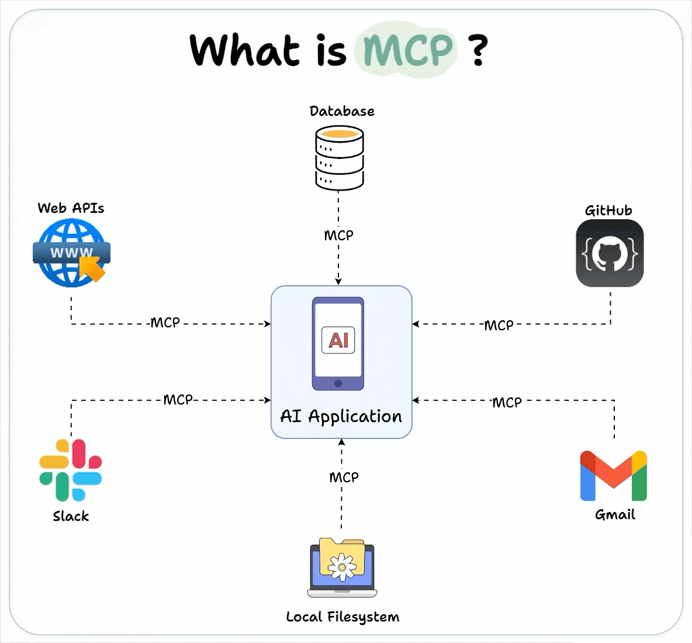
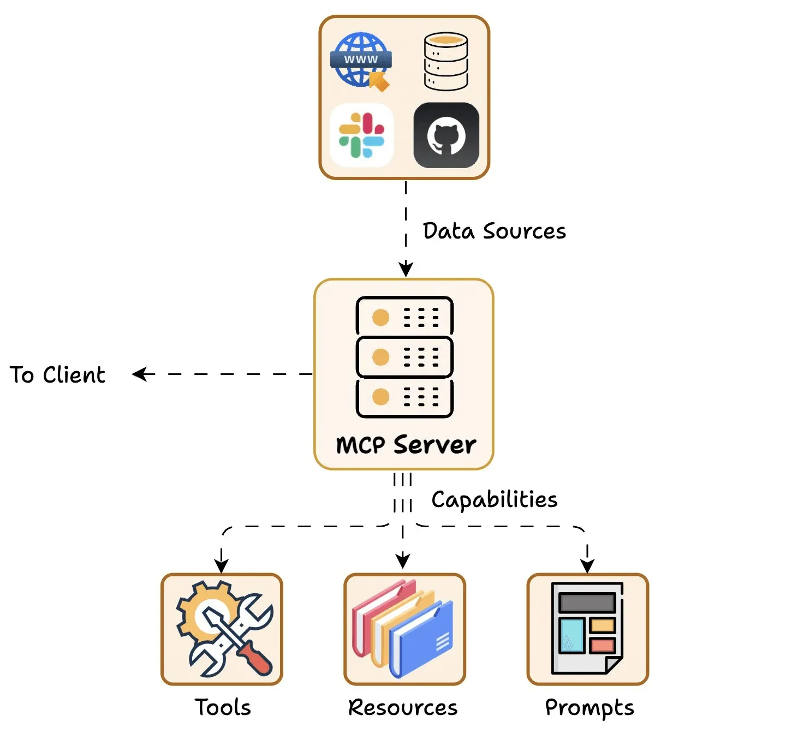

# What is Model Context Protocol (MCP)

MCP is an open standard introduced by Anthropic.
Just as USB-C offers a standardized way to connect devices to various accessories, MCP standardize how AI applications (chatbots, IDE assistants, or custom agents) connect with external tools, data sources, and systems.

# General Architecture

MCP follows a client-server architecture and consist of below key component:

## Host
Host represents any AI app (Claude desktop, Cursor) that provides an environment for AI interactions, accesses tools and data, and runs the MCP Client.

## Client
They maintain dedicated, one-to-one connections with MCP servers.

## Server
Lightweight servers exposing specific capabilities and provides access to data like:

 - Tools: Enable LLMs to perform actions through your server.

 - Resources: Expose data and content from your servers to LLMs.

 - Prompts: Create reusable prompt templates and workflows.

## Client-Server Communication

 - The client sends an initial request to learn server capabilities.

 - The server responds with details about its available tools, resources, prompts, and parameters
   - For instance, a Weather API server, when invoked, can reply back with available “tools”, “prompts templates”, and any other resources for the client to use.

# Sequencial Diagram

# Ecosystem

## Hosts
- Claude Desktop
- Cusor
- Cline

## Servers
There are a lot of servers already and we can use them through the following approach.

- [Github](https://github.com/modelcontextprotocol/servers)
  - Fetch - A server that flexibly fetches HTML, JSON, Markdown, or plaintext.
  - Google Maps - Location services, directions, and place details
  - Slack - Channel management and messaging capabilities
  - PostgreSQL - Read-only database access with schema inspection
  - Playwright - This MCP Server will help you run browser automation and webscraping using Playwright
  - ...

- Marketplace
  - [MCP Marketplace - Cline](https://cline.bot/mcp-marketplace)
  - [MCP Market | Discover Top MCP Servers](https://mcpmarket.com/)
- Develope by yourself

# Demo
## Search iPhone Prices Through Browser

In this case, I will use the Browser Automation MCP server for  and then search for the iPhone's price on the official Apple website.

 

# Reference

https://blog.dailydoseofds.com/p/visual-guide-to-model-context-protocol

